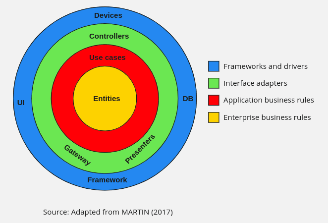
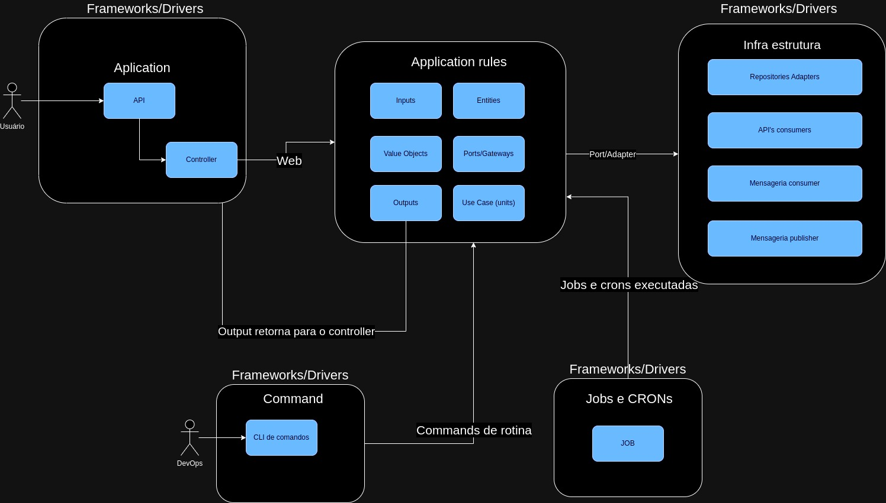

# Grupo 15
- Matheus Nunes Almeida Werneck Telles
- Lucas Gelhen Rigon
- Ricardo Luis Machado
-------------------------------------------------------

# Tech Challenge Fase 2 - Grupo 15

Base da criação da arquitetura do projeto foi baseada na forma clássica de camadas da clean arch

## Diagrama de arquitetura aplicado no projeto

### Camada de Frameworks e Drivers
* Aplicação web
* Command
* Jobs e crons

## Arquitetura de infra do Kubernets

Este projeto Kubernetes utiliza uma arquitetura de implantação para um aplicativo chamado tech-app. A implantação é configurada para manter três réplicas do aplicativo em execução.  
O aplicativo é encapsulado em um contêiner, cuja imagem é wolwer/tech-app. O contêiner expõe a porta 8080 e utiliza várias variáveis de ambiente para configuração, 
que são obtidas de um ConfigMap (my-configmap) e um Secret (my-secret).  
O aplicativo também possui sondas de prontidão e de vida, que verificam o endpoint /actuator/health para determinar a saúde do aplicativo. 
As sondas começam após um atraso inicial de 180 segundos e são executadas a cada 30 segundos.  Os recursos do contêiner são limitados a 100 milicore de CPU.
Este projeto Kubernetes também utiliza um serviço NodePort e um banco de dados Postgres com armazenamento persistente.  
O serviço NodePort é usado para expor o aplicativo tech-app para acesso externo. Ele mapeia a porta 8080 do contêiner para uma porta alta (acima de 30000) no nó do Kubernetes, 
permitindo que o aplicativo seja acessado fora do cluster.  O banco de dados Postgres é executado como um Deployment com uma única réplica. 
O contêiner Postgres expõe a porta 5432 e utiliza variáveis de ambiente para configuração, que são obtidas de um Secret (my-secret) e um ConfigMap (my-configmap).  O armazenamento persistente para o banco de dados Postgres é fornecido por um PersistentVolumeClaim chamado postgres-pvc, que solicita 1Gi de armazenamento. Este volume é montado no contêiner Postgres no caminho /var/lib/postgresql/data, garantindo que os dados do banco de dados persistam além do ciclo de vida do contêiner.
Este projeto Kubernetes também implementa o Horizontal Pod Autoscaler (HPA) e a pilha EFK (Elasticsearch, Fluentd, Kibana).  
O HPA é configurado para monitorar a utilização da CPU do aplicativo tech-app. Quando a utilização da CPU excede 90%, o HPA automaticamente escala o número de réplicas do 
aplicativo para lidar com a carga adicional. Quando a utilização da CPU cai abaixo de um determinado limite, o HPA reduz o número de réplicas.  
A pilha EFK é usada para coleta, armazenamento e visualização de logs. O Elasticsearch é configurado como um StatefulSet com uma única réplica. 
O Elasticsearch armazena os logs coletados e fornece capacidades de pesquisa. Ele é exposto na porta 9200 e utiliza um PersistentVolumeClaim chamado data para armazenamento persistente.  O Fluentd é configurado para coletar logs do aplicativo e encaminhá-los para o Elasticsearch.
E o Kibana é usado para visualizar os logs armazenados no Elasticsearch.
Este projeto Kubernetes também é compatível com o Helm, que é um gerenciador de pacotes para Kubernetes. 
O Helm permite que você empacote suas configurações do Kubernetes em um gráfico que pode ser versionado, compartilhado e publicado.  Os gráficos do Helm são organizados 
em um diretório com uma estrutura específica que inclui templates de seus recursos do Kubernetes, um arquivo Chart.yaml que contém metadados sobre o gráfico e um 
arquivo values.yaml que especifica valores padrão para suas configurações.  Para usar este projeto com o Helm, você precisaria organizar suas configurações do Kubernetes 
em um gráfico do Helm. Uma vez que o gráfico é criado, você pode instalar o gráfico em seu cluster Kubernetes com o comando helm install.  
Por exemplo, se você tivesse um gráfico do Helm para este projeto chamado tech-app, você poderia instalar o gráfico com o seguinte comando:
“helm install tech-app ./tech-app”

--------------------------------------------------------
# Tech Challenge Fase 1 - Grupo 15

## Links Úteis
- Miro Board: [Miro - Fluxo de Eventos](https://miro.com)
- Swagger UI: [Localhost Swagger](http://localhost:8080/swagger-ui/)
- Swagger subindo aplicação com Kubernetes: [Localhost Swagger Kubernetes](http://localhost:30000/swagger-ui/)
- Swagger UI: [Railway Swagger](https://fiap-production.up.railway.app/swagger-ui/index.html#/)

## Sobre o Projeto
Este documento apresenta o fluxo do Tech Challenge realizado como parte da pós-graduação. O desafio envolveu a criação de um sistema de backend para uma lanchonete.

### Fluxo de Eventos da Lanchonete (Totem)

#### Contexto: Identificação
- **Identificação do Cliente**: O cliente escolhe se quer se identificar ou não. Isso pode influenciar a personalização do serviço e a rapidez do processo de pedido.

#### Contexto: Gerenciamento de Produtos
- **Criação de Produto**: Adicionar novos produtos ao sistema, definindo características como preço, categoria e descrição.
- **Edição de Produto**: Atualizar informações de produtos existentes, como alterar preços, descrições ou disponibilidade.
- **Exclusão de Produto**: Remover produtos do catálogo quando necessário.
- **Busca de Produto por Categoria**: Buscar produtos existentes por categoria.

#### Contexto: Criação do Pedido
- **Criação de Pedido**: O cliente ou o operador do totem cria um pedido, selecionando produtos e quantidades desejadas.
- **Adição de Itens ao Pedido**: Possibilidade de adicionar ou modificar itens no pedido antes da finalização.
- **Confirmação de Pedido**: O cliente confirma o pedido, possibilitando avançar para o checkout.

#### Contexto: Checkout
- **Finalização do Pedido**: O pedido é enviado para a fila e seu status é alterado.

#### Contexto: Listagem de Pedidos
- **Lista de Pedidos**: Lista todos os pedidos na fila.
-----------------------------------------------------------------------